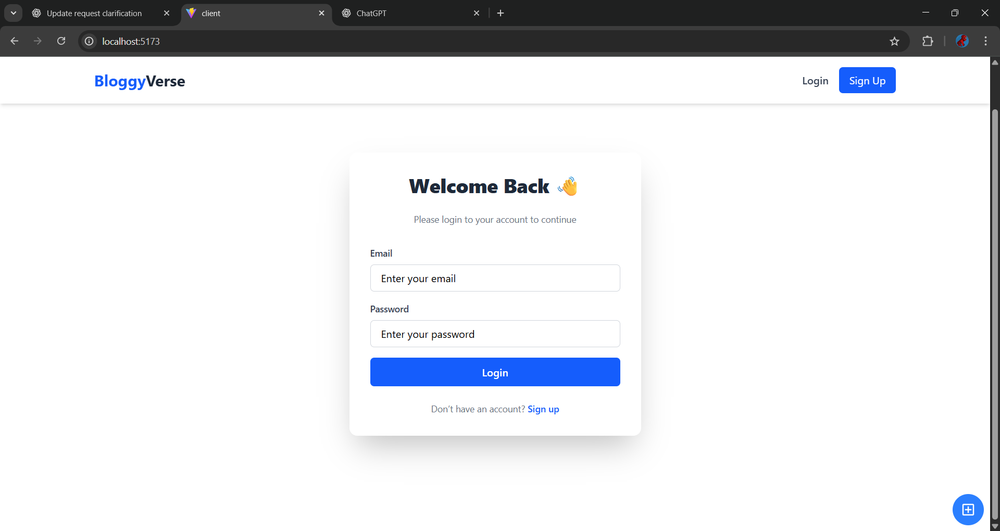
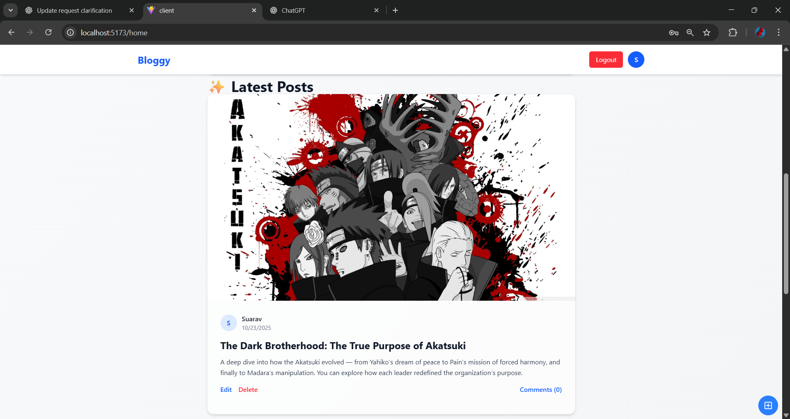
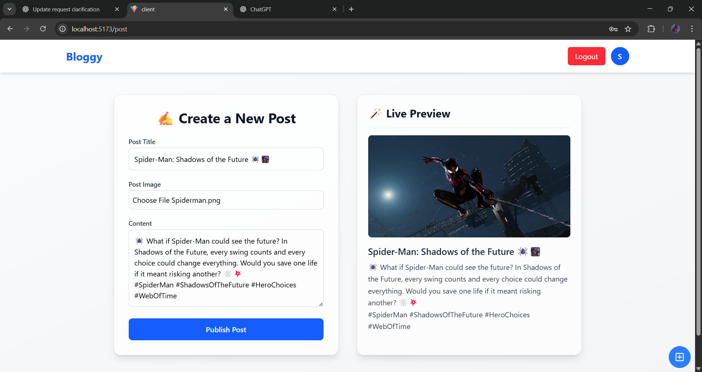
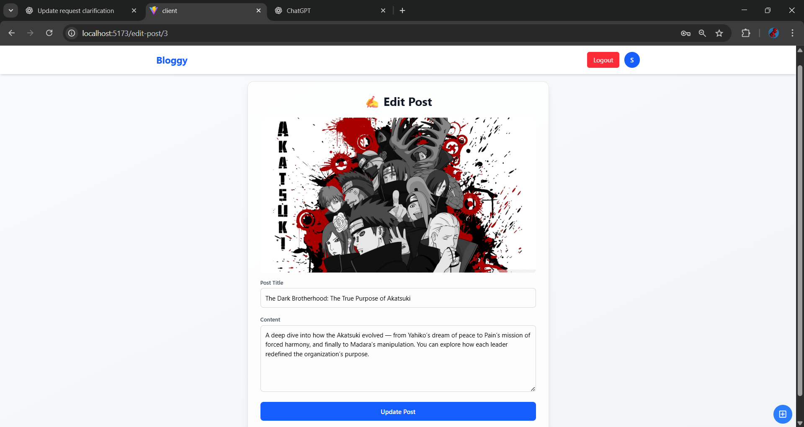
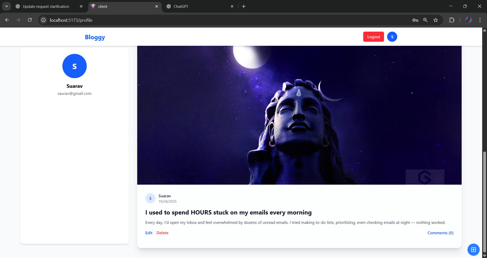

# Bloggy

A simple social post app where users can create, edit, delete posts, and comment on them.

## Features
- User login with JWT
- Create/edit/delete posts
- Upload images with posts
- Add/delete comments
- Dashboard showing user info and posts

## Tech Stack
- Frontend: React, Axios, React Router, Tailwind CSS  
- Backend: Spring Boot, Spring Security, JWT, MySQL

## Setup

### Backend
```bash
cd bloggy-backend
./mvnw spring-boot:run
```
###Frontend
```
cd frontend
npm install
npm run dev
```

###ScreenShot
Here’s a glimpse of **BuyIt** in action:

<p align="center">
  
  

  
  

  
</p>
